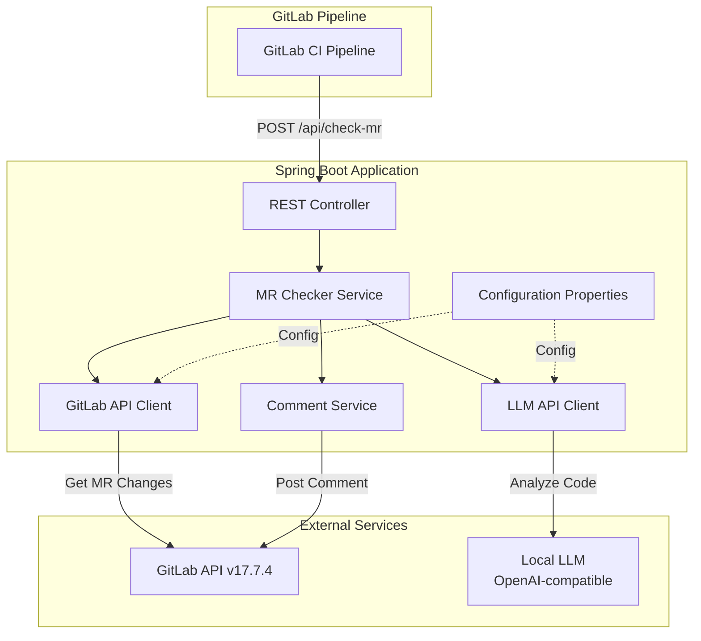
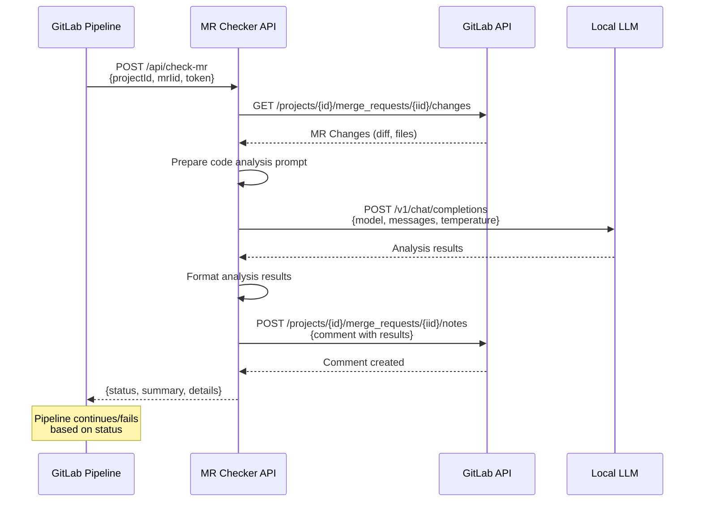
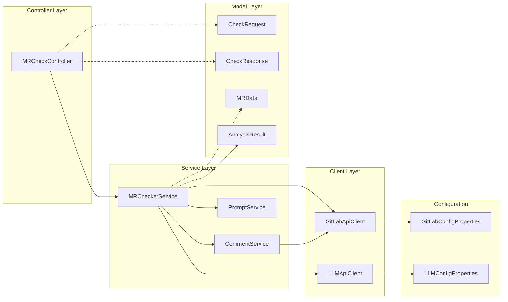
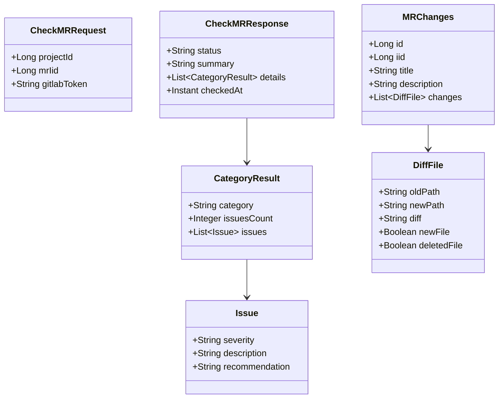

# Дизайн-документ: MR Checker для GitLab

## 1. Архитектурная диаграмма



## 2. Диаграмма последовательности проверки MR



## 3. Диаграмма компонентов



## 4. Описание разрабатываемой функциональности

### 4.1 Основной функционал

**Прием запроса на проверку MR**
- REST API endpoint для вызова из GitLab Pipeline
- Получение параметров: ID проекта, IID merge request, токен аутентификации
- Валидация входных данных

**Получение изменений из GitLab**
- Интеграция с GitLab API v17.7.4
- Получение diff-файлов измененного кода
- Извлечение метаданных MR (автор, описание, затронутые файлы)

**Анализ кода через LLM**
- Формирование промпта для анализа кода
- Отправка запроса к локальной LLM через OpenAI-совместимый интерфейс
- Анализ по четырем категориям:
  1. Логические ошибки
  2. Потенциальные уязвимости безопасности
  3. Нарушения best practices
  4. Проблемы производительности

**Обработка результатов анализа**
- Парсинг ответа от LLM
- Структурирование найденных проблем
- Формирование читаемого комментария для разработчика

**Публикация результатов в GitLab**
- Создание комментария к MR с результатами анализа
- Возврат статуса проверки в pipeline (success/warning/failure)
- Обработка ошибок с созданием информативных комментариев

### 4.2 Обработка ошибок

**Недоступность GitLab API**
- Логирование ошибки
- Возврат статуса failure с описанием проблемы

**Недоступность LLM**
- Попытка создать комментарий в MR о недоступности LLM
- Возврат статуса failure
- Детальное логирование для диагностики

**Ошибки аутентификации**
- Проверка валидности токенов
- Информативные сообщения об ошибках доступа

**Timeout при анализе больших MR**
- Настраиваемые таймауты для HTTP-клиентов
- Обработка timeout exception с уведомлением в комментарии

## 5. Ограничения функциональности

### 5.1 Текущие ограничения

- **Без сохранения истории**: результаты проверок не сохраняются в БД, повторный анализ не оптимизируется
- **Без привязки к строкам**: комментарии публикуются к MR в целом, а не к конкретным строкам кода
- **Одна LLM за раз**: не поддерживается параллельный запрос к нескольким моделям
- **Без кэширования**: повторные проверки одного и того же кода выполняются заново
- **Без приоритизации**: все проблемы имеют одинаковый приоритет
- **Без интеграции с Jira/Tracker**: найденные проблемы не создают автоматические задачи

### 5.2 Ограничения масштабирования

- **Размер MR**: очень большие MR (>5000 строк) могут превышать лимиты контекста LLM
- **Последовательная обработка**: запросы обрабатываются последовательно, без очередей
- **Без rate limiting**: нет защиты от перегрузки при множественных одновременных запросах

### 5.3 Безопасность

- **Токены в конфигурации**: токены хранятся в application.yml (рекомендуется использовать внешние секреты)
- **Без шифрования трафика внутри сети**: предполагается защищенная внутренняя сеть
- **Без аудита**: действия пользователей не логируются для аудита

## 6. Ключевые директории и файлы

### 6.1 Создаваемые директории

```
src/main/java/com/mr/checker/
├── config/                    # Конфигурационные классы
├── controller/                # REST контроллеры
├── service/                   # Бизнес-логика
├── client/                    # Клиенты внешних API
├── model/                     # Модели данных (DTO, entities)
│   ├── request/              # Request DTO
│   ├── response/             # Response DTO
│   └── gitlab/               # GitLab модели
├── exception/                # Кастомные исключения
└── util/                     # Утилитные классы

src/main/resources/
├── application.yml           # Основная конфигурация
└── application-dev.yml       # Dev конфигурация

src/test/java/com/mr/checker/
├── controller/               # Тесты контроллеров
├── service/                  # Тесты сервисов
└── client/                   # Тесты клиентов
```

### 6.2 Основные файлы

**Конфигурация**
- `config/GitLabConfig.java` - настройка GitLab клиента
- `config/LLMConfig.java` - настройка LLM клиента
- `config/RestClientConfig.java` - общие настройки RestClient
- `config/properties/GitLabProperties.java` - GitLab properties
- `config/properties/LLMProperties.java` - LLM properties

**Контроллеры**
- `controller/MRCheckController.java` - REST API endpoint для проверки MR

**Сервисы**
- `service/MRCheckerService.java` - оркестрация процесса проверки
- `service/CommentService.java` - создание комментариев в GitLab
- `service/PromptService.java` - формирование промптов для LLM
- `service/AnalysisFormatter.java` - форматирование результатов

**Клиенты**
- `client/GitLabApiClient.java` - взаимодействие с GitLab API
- `client/LLMApiClient.java` - взаимодействие с LLM API

**Модели**
- `model/request/CheckMRRequest.java` - запрос на проверку MR
- `model/response/CheckMRResponse.java` - результат проверки
- `model/gitlab/MRChanges.java` - изменения в MR
- `model/gitlab/DiffFile.java` - diff файла
- `model/llm/ChatRequest.java` - запрос к LLM
- `model/llm/ChatResponse.java` - ответ от LLM
- `model/AnalysisResult.java` - результат анализа кода

**Исключения**
- `exception/GitLabApiException.java` - ошибки GitLab API
- `exception/LLMApiException.java` - ошибки LLM API
- `exception/MRCheckException.java` - общие ошибки проверки
- `exception/GlobalExceptionHandler.java` - глобальный обработчик

**Утилиты**
- `util/DiffParser.java` - парсинг git diff
- `util/MarkdownFormatter.java` - форматирование в Markdown

**Конфигурационные файлы**
- `application.yml` - конфигурация приложения
- `pom.xml` - зависимости Maven (обновление)

### 6.3 Изменяемые файлы

- `pom.xml` - добавление зависимостей (WebClient, GitLab SDK)
- `SocialNetworkApplication.java` - возможное переименование главного класса

## 7. Технологический стек

### 7.1 Основные технологии

- **Spring Boot 3.x** - основной фреймворк
- **Spring Web** - REST API
- **Spring WebClient** - HTTP клиент для внешних API
- **Java 17+** - язык программирования

### 7.2 Зависимости

- **GitLab4J-API** - Java клиент для GitLab API (опционально)
- **Jackson** - JSON сериализация/десериализация
- **Lombok** - уменьшение boilerplate кода
- **Validation API** - валидация входных данных
- **SLF4J + Logback** - логирование

### 7.3 Тестирование

- **JUnit 5** - unit тесты
- **Mockito** - моки для тестов
- **WireMock** - моки внешних HTTP сервисов
- **Spring Boot Test** - интеграционные тесты

## 8. Конфигурация приложения

### 8.1 Основные параметры

```yaml
gitlab:
  url: https://gitlab.example.com
  token: ${GITLAB_TOKEN}
  api-version: v4
  timeout: 30000

llm:
  url: http://localhost:11434
  model: codellama
  timeout: 60000
  temperature: 0.1
  max-tokens: 4000

app:
  analysis:
    categories:
      - logical-errors
      - security-vulnerabilities
      - best-practices
      - performance-issues
```

## 9. Модель данных (DTO)



## 10. API Endpoint

### POST /api/v1/check-mr

**Request:**
```json
{
  "projectId": 123,
  "mrIid": 456,
  "gitlabToken": "optional_override_token"
}
```

**Response (Success):**
```json
{
  "status": "success",
  "summary": "Проверка завершена. Найдено: 3 проблемы",
  "details": [
    {
      "category": "security-vulnerabilities",
      "issuesCount": 1,
      "issues": [
        {
          "severity": "high",
          "description": "Потенциальная SQL-инъекция в методе getUserById",
          "recommendation": "Используйте PreparedStatement вместо конкатенации строк"
        }
      ]
    }
  ],
  "checkedAt": "2025-11-16T12:30:45Z"
}
```

**Response (Error):**
```json
{
  "status": "failure",
  "summary": "Ошибка при проверке MR",
  "error": "Не удалось подключиться к LLM API",
  "checkedAt": "2025-11-16T12:30:45Z"
}
```

## 11. Процесс работы

### 11.1 Нормальный flow

1. Pipeline вызывает POST /api/v1/check-mr с параметрами MR
2. Приложение получает изменения из GitLab API
3. Формируется промпт с кодом и инструкциями для анализа
4. Промпт отправляется в LLM
5. Ответ от LLM парсится и структурируется
6. Результаты форматируются в Markdown
7. Создается комментарий в MR с результатами
8. Возвращается ответ в pipeline со статусом

### 11.2 Error flow

1. Возникает ошибка на любом этапе
2. Ошибка логируется
3. Создается комментарий в MR (если доступен GitLab)
4. Возвращается response со статусом failure и описанием

## 12. Безопасность

- Токены передаются через заголовки HTTP
- Валидация всех входных данных
- Использование HTTPS для внешних подключений
- Логирование действий без чувствительных данных
- Rate limiting на уровне GitLab pipeline

