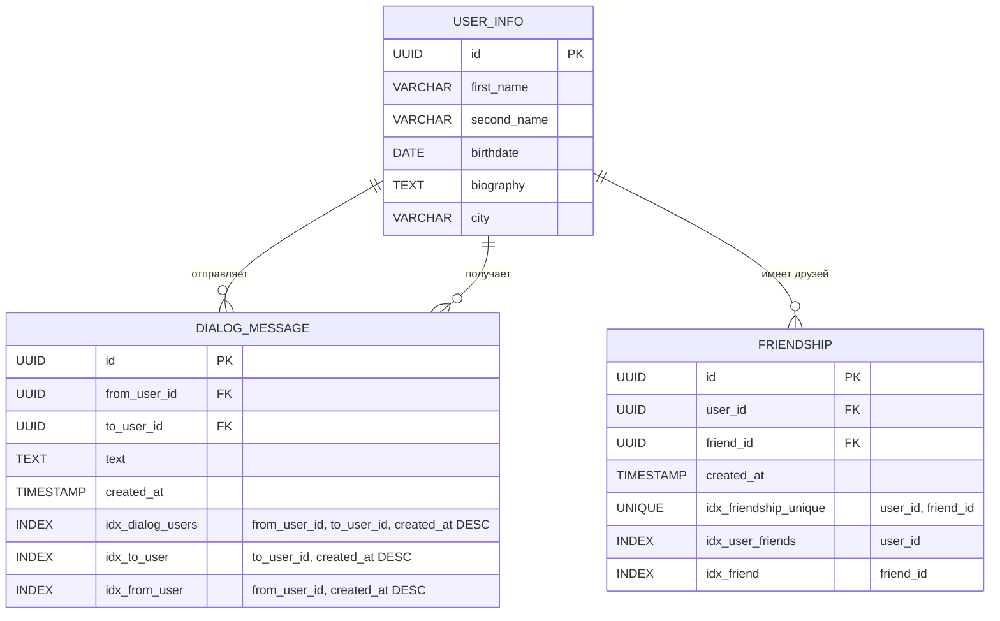
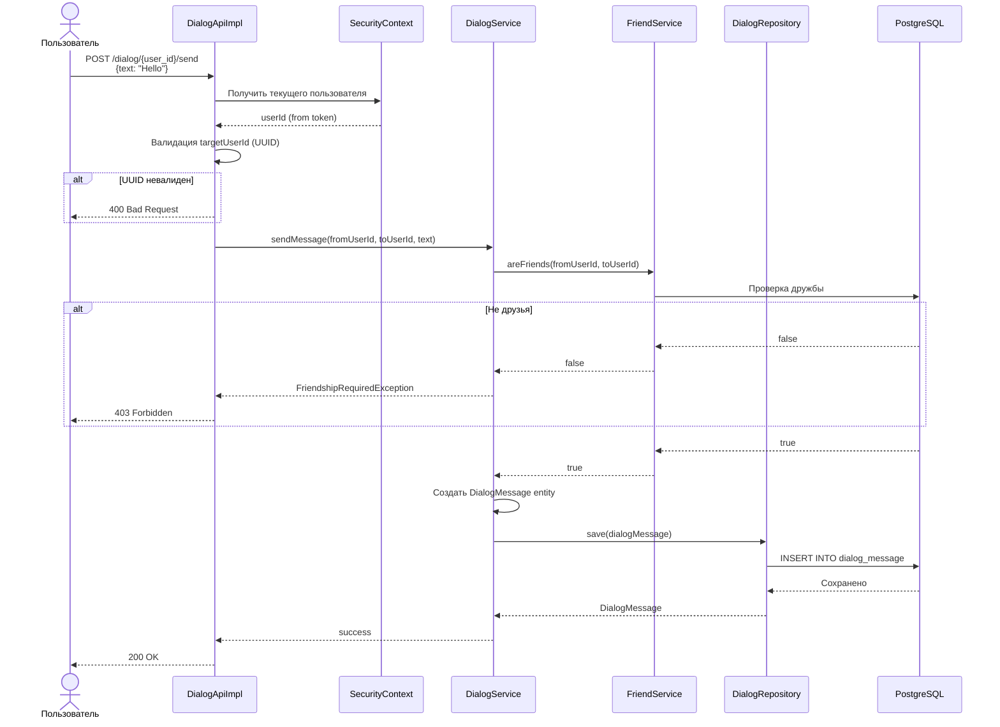
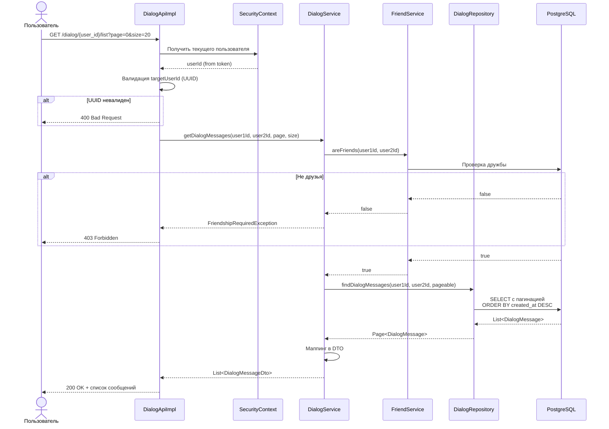
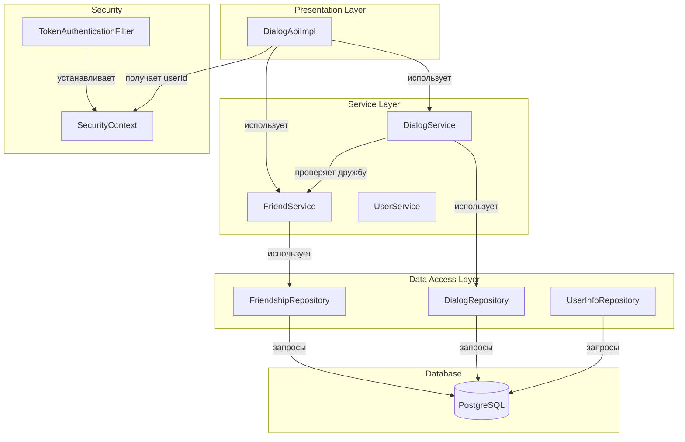

# Дизайн решения: Функционал диалогов (DialogApi)

## Схемы Mermaid

### ERD диаграмма

### Диаграмма последовательности: Отправка сообщения

### Диаграмма последовательности: Получение списка сообщений

### Диаграмма компонентов

## Описание разрабатываемой функциональности

### Общее описание
Реализация функционала личных сообщений (диалогов) между пользователями социальной сети. Система позволяет пользователям отправлять текстовые сообщения друг другу и просматривать историю диалогов.

### Основные функции

#### 1. Отправка сообщения (POST /dialog/{user_id}/send)
- Пользователь отправляет текстовое сообщение другому пользователю
- Автоматически определяется отправитель из токена авторизации
- Создается запись в БД с временной меткой
- Возвращается статус успешной отправки

#### 2. Получение списка сообщений (GET /dialog/{user_id}/list)
- Получение истории диалога между двумя пользователями
- Сообщения отсортированы от новых к старым
- Поддержка пагинации (параметры page и size)
- Возвращается список сообщений с полной информацией

### Бизнес-логика

#### Проверка дружбы
- Перед отправкой сообщения проверяется наличие дружеских связей
- Перед получением списка сообщений также проверяется дружба
- Если пользователи не друзья - возвращается ошибка 403 Forbidden

#### Идентификация отправителя
- Отправитель определяется из токена авторизации
- Используется SecurityContext для получения данных текущего пользователя
- В параметрах API указывается только получатель

#### Пагинация
- Поддержка параметров page (номер страницы, начиная с 0) и size (размер страницы)
- По умолчанию: page=0, size=20
- Использование Spring Data Pageable

## Ограничения функциональности

### Бизнес-ограничения
1. **Дружба обязательна**: Отправлять сообщения можно только друзьям
2. **Только текст**: Поддерживаются только текстовые сообщения (без вложений, медиа)
3. **Только двусторонние диалоги**: Нет групповых чатов
4. **Без редактирования**: Отправленные сообщения нельзя редактировать
5. **Без удаления**: Отправленные сообщения нельзя удалить
6. **Без статусов прочтения**: Нет информации о прочтении сообщений
7. **Без онлайн-статуса**: Нет информации о том, онлайн ли пользователь

### Технические ограничения
1. **Размер текста**: Ограничение TEXT в PostgreSQL (до 1 ГБ, но рекомендуется до 65535 символов)
2. **Авторизация обязательна**: Все операции требуют валидного токена
3. **Синхронная обработка**: Без использования асинхронных механизмов (согласно требованиям)
4. **Без real-time**: Нет WebSocket, push-уведомлений
5. **Без поиска**: Нет поиска по содержимому сообщений
6. **Пагинация обязательна**: Нельзя получить все сообщения за один запрос

### Производительность
1. **Индексы БД**: Композитные индексы для оптимизации запросов
2. **Лимит на size**: Максимальный размер страницы - 100 сообщений
3. **Timeout запросов**: Стандартные таймауты Spring Boot
4. **Connection pool**: Ограничение по количеству одновременных подключений к БД

## Ключевые директории и файлы

### Создаваемые файлы

#### Слой БД (Database Layer)
- `src/main/resources/db/changelog/db.changelog-3.0.xml` - миграции для таблиц dialog_message и friendship

#### Модели (Model/Entity)
- `src/main/java/com/highload/architect/soc/network/model/DialogMessageEntity.java` - Entity для сообщений диалога
- `src/main/java/com/highload/architect/soc/network/model/Friendship.java` - Entity для дружеских связей

#### Репозитории (Repository)
- `src/main/java/com/highload/architect/soc/network/repository/DialogMessageRepository.java` - JPA Repository для сообщений
- `src/main/java/com/highload/architect/soc/network/repository/FriendshipRepository.java` - JPA Repository для дружбы

#### Сервисы (Service Layer)
- `src/main/java/com/highload/architect/soc/network/service/DialogService.java` - интерфейс сервиса диалогов
- `src/main/java/com/highload/architect/soc/network/service/impl/DialogServiceImpl.java` - реализация сервиса диалогов
- `src/main/java/com/highload/architect/soc/network/service/FriendService.java` - интерфейс сервиса дружбы
- `src/main/java/com/highload/architect/soc/network/service/impl/FriendServiceImpl.java` - реализация сервиса дружбы

#### Мапперы (Mapper)
- `src/main/java/com/highload/architect/soc/network/mapper/DialogMessageMapper.java` - маппер Entity <-> DTO для сообщений

#### Исключения (Exceptions)
- `src/main/java/com/highload/architect/soc/network/exception/FriendshipRequiredException.java` - исключение отсутствия дружбы

#### Утилиты (Utils)
- `src/main/java/com/highload/architect/soc/network/util/SecurityUtils.java` - утилита для работы с SecurityContext

### Изменяемые файлы

#### Контроллеры (API)
- `src/main/java/com/highload/architect/soc/network/api/DialogApiImpl.java` - добавление полной реализации методов
- `src/main/java/com/highload/architect/soc/network/api/FriendApiImpl.java` - добавление реализации управления друзьями

#### Конфигурация БД
- `src/main/resources/db/changelog/db.changelog-master.xml` - добавление include для 3.0

#### Обработка исключений
- `src/main/java/com/highload/architect/soc/network/exception/ErrorResponseHandler.java` - добавление обработки FriendshipRequiredException

### Тестовые файлы (создаются)
- `src/test/java/com/highload/architect/soc/network/api/DialogApiImplTest.java` - интеграционные тесты
- `src/test/java/com/highload/architect/soc/network/service/impl/DialogServiceImplTest.java` - unit-тесты сервиса
- `src/test/java/com/highload/architect/soc/network/service/impl/FriendServiceImplTest.java` - unit-тесты сервиса дружбы
- `src/test/java/com/highload/architect/soc/network/repository/DialogMessageRepositoryTest.java` - тесты репозитория

